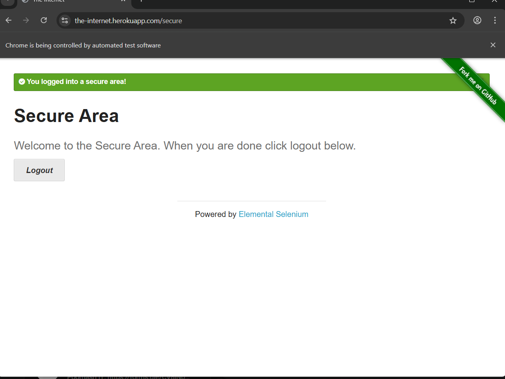
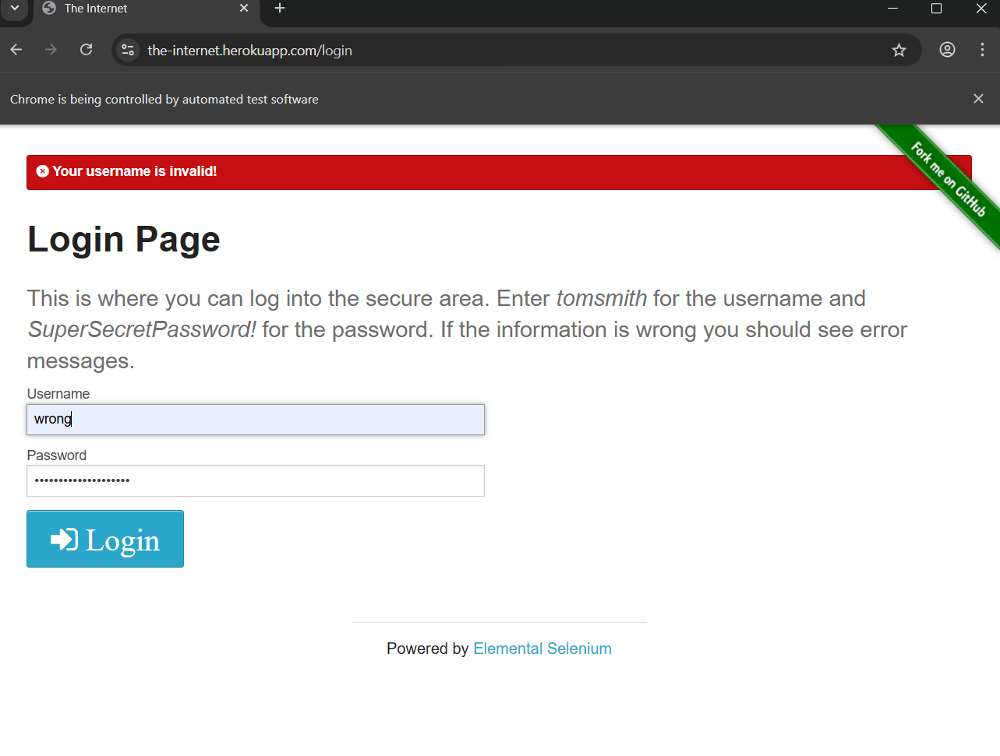
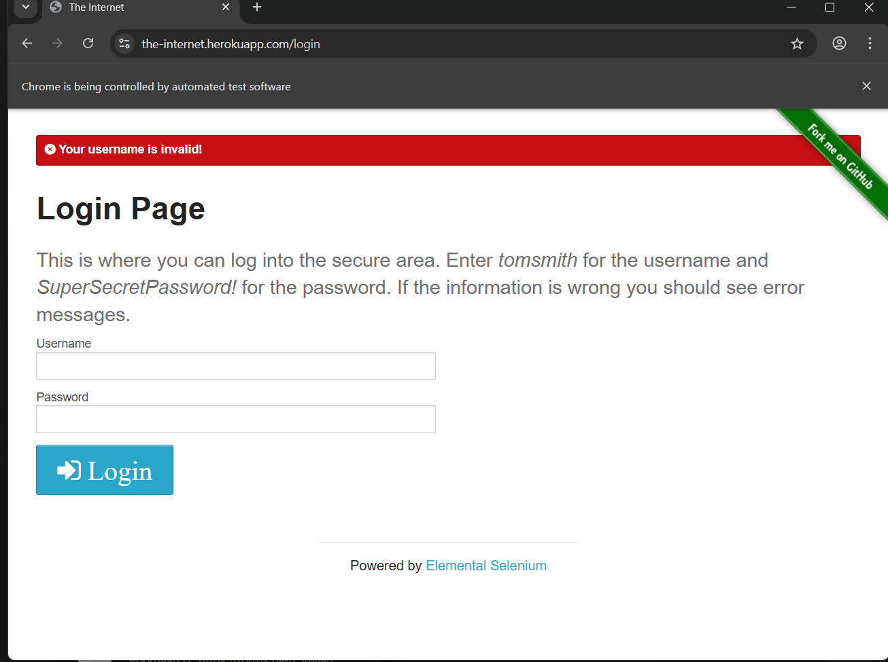
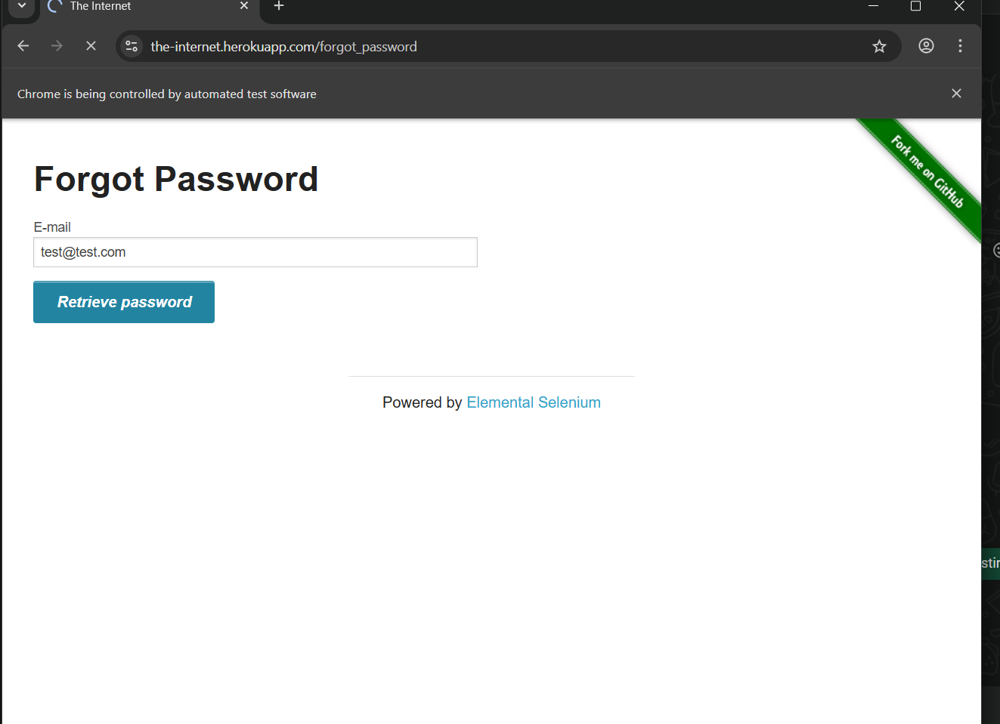

# data-driven-selenium

# Selenium Automation Project

## Description
This project automates login functionality using Selenium and Python.

## Tools Used
- Python
- Selenium
- Pytest

##  Project Structure
- tests/
- pytest.ini

##  How to Run
python -m pytest -v

##  Website Tested
https://practicetestautomation.com/practice-test-login/

## Output Screenshots

### 1. Valid Login Test

### 2. Invalid Login Test

### 3. Empty Input Test

### 4. Forgot Password Test

